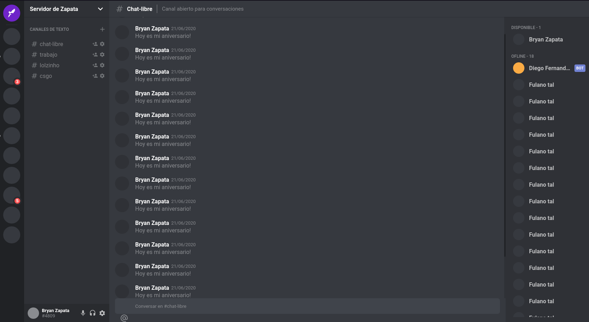

<h1 align="center">
 
Discord Clone
</h1>

discord clone with typescript + styled components

  

[//]: # "Add your gifs/images here:"

  
  <!--  -->

## Features

[//]: # "Add the features of your project here:"

This app features all the latest tools and practices in web development!

- ⚛️ **React Js TypeScript** — A JavaScript library for building user interfaces

## License

This project is licensed under the MIT License - see the [LICENSE](https://opensource.org/licenses/MIT) page for details.
